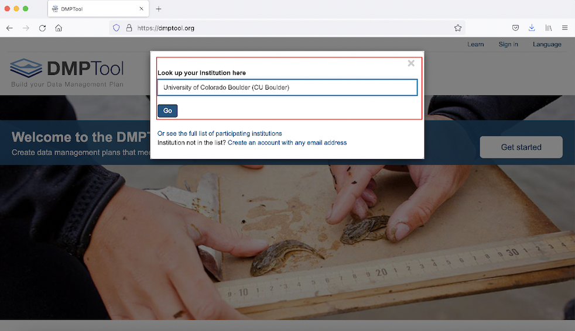

# Using DMPTool

## Log into your DMPTool account and view your personal dashboard

Go to the [DMPTool](https://dmptool.org) website, and select the option to sign in via the institutional portal:

```{r, echo=FALSE, fig.cap="Sign into DMPTool via your institution"}
knitr::include_graphics("images/pic1.png")
```

Then, select University of Colorado, Boulder; once you click **Go**, you will be able to sign in via your Identikey:

```{r, echo=FALSE, fig.cap="Look up CU Boulder and click 'Go' to sign in via IdentiKey"}

```

## Create a new plan


